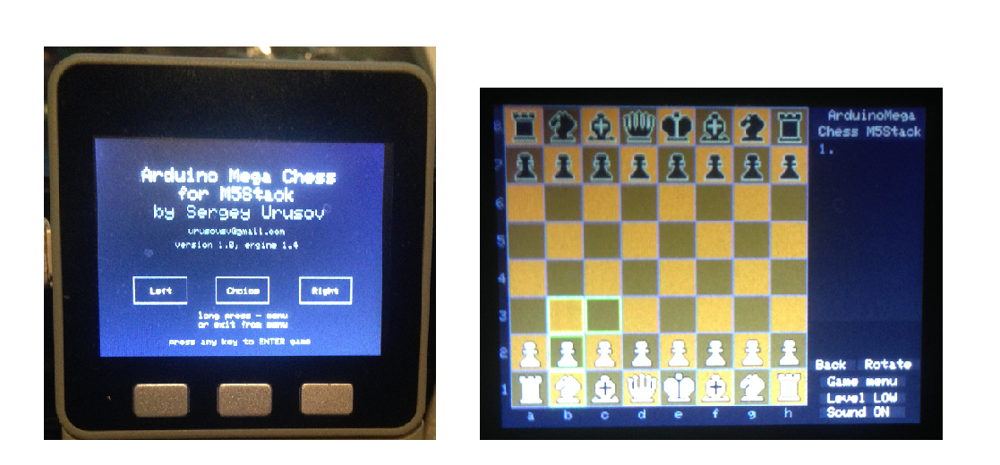

# M5Stack-MegaChess
    

 

   

## About
- Arduino MegaChess converted for use on the M5Stack ESP32 Development System.

- Full details and useage instructions [here](https://create.arduino.cc/projecthub/Sergey_Urusov/arduino-mega-chess-for-m5stack-7feafb)

- Project by Sergey Urusov 

   

## M5Stack Performance
- Advantages of M5Stack platform are repeatability and solving power of ESP32. 

- In comparison with original project, performance level increases up to about 15 times, and is 2000-5000 nodes per second, which provides up to 10 plyes depth of solving tree in hard situations, and more in easy positions.

   

## Controls
- Interface uses 3 buttons - left, choice, and right. 
- Left and right to choose move (highlighted with green frames), choice button to make move.
- Long press of choice button (more then half of second press and release) to open menu, or close menu and return to game mode.

 
 

## Video Demonstration

 
 

 
